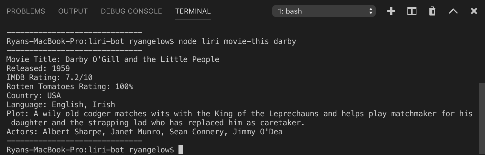
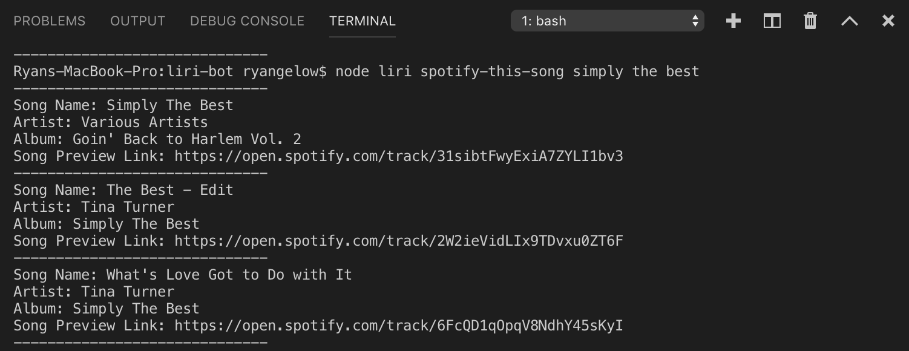
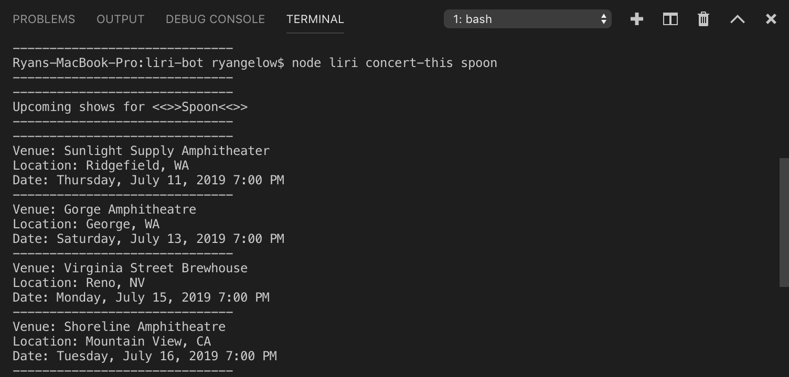

# The LIRI app

1. This node application brings useful information about movies and music to your termincal in a simple request. It also allows for text to be entered into a file and run through this code for similar output. Calling for data using only one request line in the terminal, makes it easy to run through corresponding APIs, and return many relevant facts and stats about the entered subject.

2. As previously mentioned, this is a node app and starts with many of the required npm packages and APIs. The liri function loads on the start of the node app and checks if the subsequent lines in the process.argv array call for one of 4 different functions depending on what parameter is. It then packages and runs that secondary subject into the specific function call. Each function is listed out separately following the main liri function. They are each integrated with either the IMDB API, the BandInTown API, the Spotify API, the Moment API, and/or the FS API. The Movies and Live Music functions utilize Axios to request the data, which is then formated for display. The Songs function use the Node Spotify API, specifcally the search method. For the "do-what-it-says" function, it required we change from a global variable accessing process.argv to more nested variables in functions.

3. There are 4 main avenues with this node app and 2 main steps. 

    1. Open the corresponding folder in your terminal, and then begin the process by typing "node liri.js". 
    
    2. Add a space and append one of these other 4 commands:

        1. `concert-this`
        2. `spotify-this-song`
        3. `movie-this`
        4. `do-what-it-says`

    Following the above first 3 commands, add a space then enter either a band or artist name, a song title, or a movie title, respectively after commands 1, 2, or 3. 

    In 4, just type "node liri.js do-what-it-says", and it will process any custom command of step 2 listed in the following format:

    * movie-this,"the matrix"

    Examples:
    
    * node liri.js do-what-it-says
    * node liri.js concert-this The White Stripes
    * node liri.js concert-this adele
    * node liri.js movie-this con air
    * node liri.js movie-this You've Got Mail
    * node liri.js spotify-this-song shake it off
    * node liri.js spotify-this-song Enter Sandman

4. Here are a few photo examples of the liri node app:
    * 
    * 
    * 

5. Link to app: https://ryangelow.github.io/liri-node-app/

6. Technologies used:
    * [Node-Spotify-API](https://www.npmjs.com/package/node-spotify-api)
    * [Axios](https://www.npmjs.com/package/axios)
    * Using Axios:
        * [OMDB API](http://www.omdbapi.com)   
        * [Bands In Town API](http://www.artists.bandsintown.com/bandsintown-api)
   * [Moment](https://www.npmjs.com/package/moment)
   * [DotEnv](https://www.npmjs.com/package/dotenv)
   * [File-System](https://www.npmjs.com/package/file-system) 
7. List of key individuals:
    * Lead-Developer: Ryan Gelow
    * Assistance: Kit Te